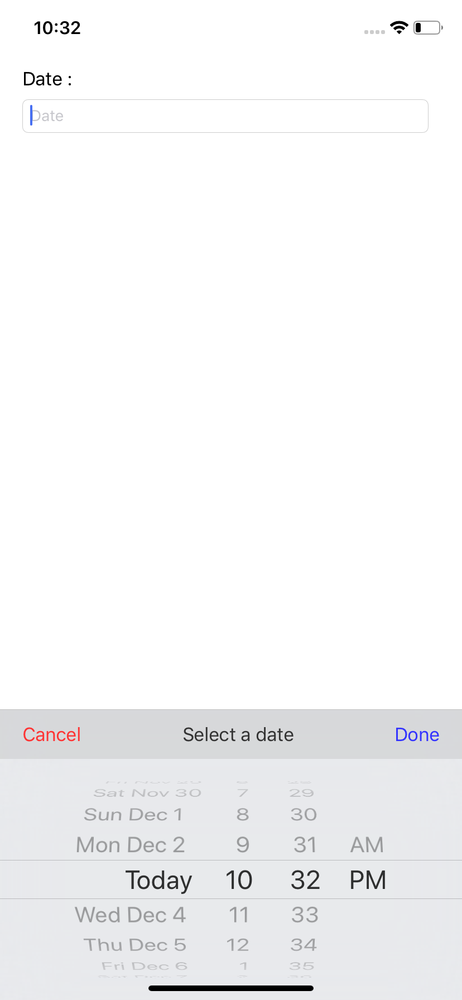
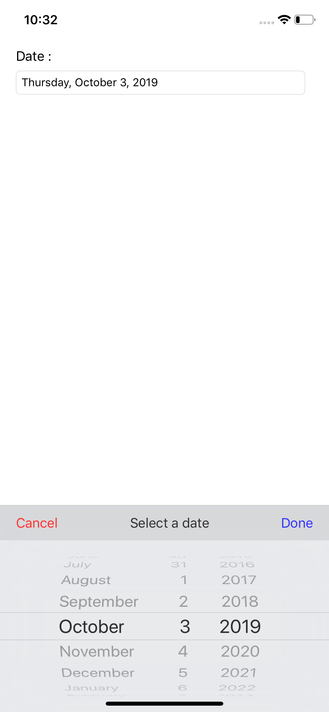
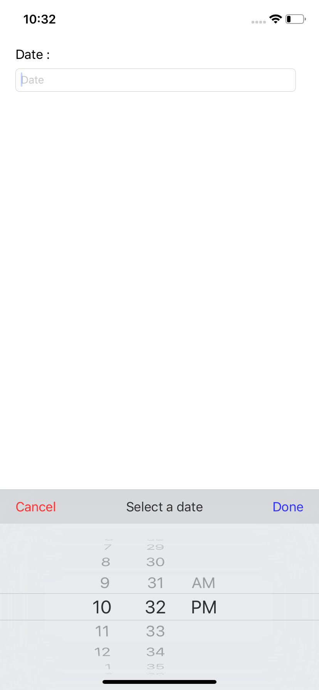

# UIDatePicker
Reusable UIDatePicker View using toolbar

## How to use

1. Drag and drop UITextField+Extension file inn your project
2. add the following lines of code in your viewcontroller file 

        class ViewController: UIViewController , UITextFieldDelegate{

            @IBOutlet weak var myTextField: UITextField!

            override func viewDidLoad() {
                super.viewDidLoad()
                // Do any additional setup after loading the view, typically from a nib.

                self.myTextField.setInputViewDatePicker(target: self, selector:  #selector(tapDone), title: "Select a date", maxDate: nil, minDate: nil, dateType: UIDatePicker.Mode.time)
            }

            @objc func tapDone() {
                if let datePicker = self.myTextField.inputView as? UIDatePicker {
                    let dateformatter = DateFormatter()
                    dateformatter.dateStyle = .full
                    self.myTextField.text = dateformatter.string(from: datePicker.date) 
                }
                self.myTextField.resignFirstResponder()
            }
        }

